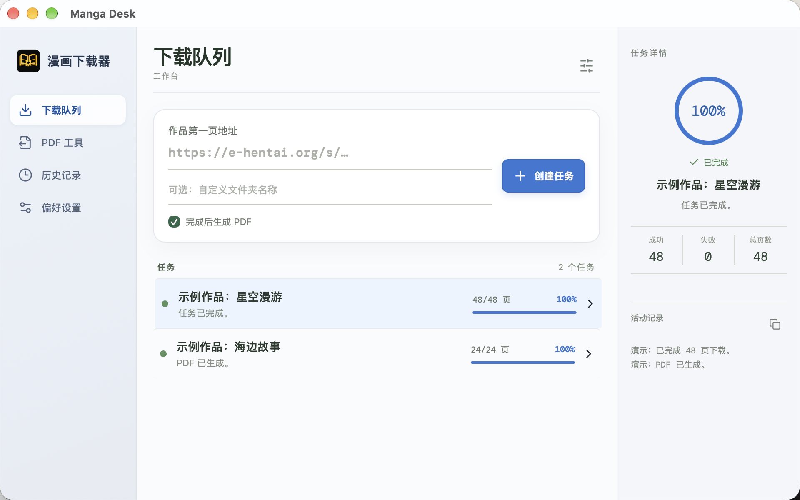
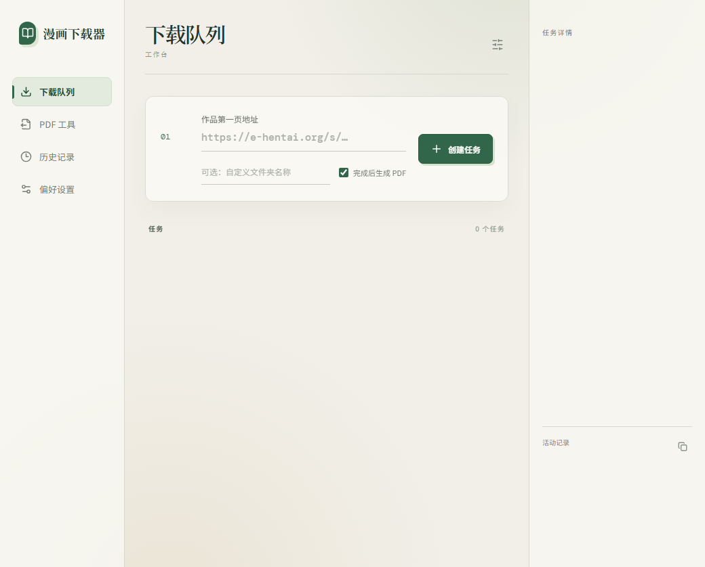

# Manga Desk

漫画下载桌面工具。`v0.2.3` 提供 Windows 安装包和 macOS 磁盘映像。两个界面使用同一套 Python 下载引擎，提供下载队列、PDF 生成、输出目录打开和 JSON 会话记录。

## 界面预览

macOS 开发版（演示任务数据）：



Windows `v0.2.2` 发布版：



## 安装

从 [Releases](https://github.com/flyingrtx2333/ehentaiDownloader/releases) 选择系统对应的文件：Windows 下载 `*_windows_x64-setup.exe`；Apple 芯片 Mac 下载 `*_macos_arm64.dmg`；Intel Mac 下载 `*_macos_x86_64.dmg`。安装包均内置下载引擎，使用时不需要单独安装 Python。macOS 包目前未进行 Apple 公证，首次打开若被系统拦截，可在“系统设置 → 隐私与安全性”中允许打开。

## 功能

- 粘贴作品第一页地址，创建并查看下载任务。
- 可指定保存位置、文件夹名称，并在完成后生成 PDF。
- 点击已完成任务可在系统文件管理器打开输出文件夹；PDF 会定位到生成文件。
- 任务状态与最近 200 条活动记录保存在系统应用数据目录的 `session.json`，重启后自动恢复。
- 下载、PDF 工具、历史记录和偏好设置均在同一桌面界面中完成。

## 从源码运行

需要 Node.js、Rust 和 Python 3.10+。macOS 可用 `brew install node python@3.12` 和 [rustup](https://rustup.rs/) 安装工具链。在项目根目录准备 Python 依赖：

```bash
python3.12 -m venv .venv
.venv/bin/python -m pip install -r requirements.txt
```

Windows 使用 `py -3.12 -m venv .venv`，再用 `.venv\Scripts\python.exe -m pip install -r requirements.txt`。

然后启动桌面开发环境：

```bash
cd desktop
npm install
npm run tauri dev
```

桌面前端按运行系统选择 `desktop/src/windows/` 或 `desktop/src/mac/`。两个界面分别维护，使用共用的 Python 引擎。macOS 界面默认保存到系统“下载”目录。开发时可用 `MANGA_DESK_PYTHON` 指定 Python 解释器；默认优先使用根目录 `.venv`。

如需仅使用旧版 Tk 界面：

```bash
python ui.py
```

## 发布构建

在目标系统上安装 PyInstaller，并先生成内置 Python 引擎：

```bash
python -m pip install -r requirements.txt "pyinstaller>=6,<7"
python desktop/scripts/build_engine.py
```

Windows：在 `desktop/` 运行 `npx tauri build --config src-tauri/tauri.windows.conf.json`。macOS：在 `desktop/` 运行 `npx tauri build --config src-tauri/tauri.macos.conf.json`，然后从仓库根目录运行 `bash desktop/scripts/package_macos.sh`。推送 `v*` 标签会自动构建 Windows、Apple 芯片和 Intel Mac 三种产物，并在全部成功后创建 Release。

## 代理配置

在桌面应用的“偏好设置”中填写代理主机和端口。默认值为 `127.0.0.1:7890`。
